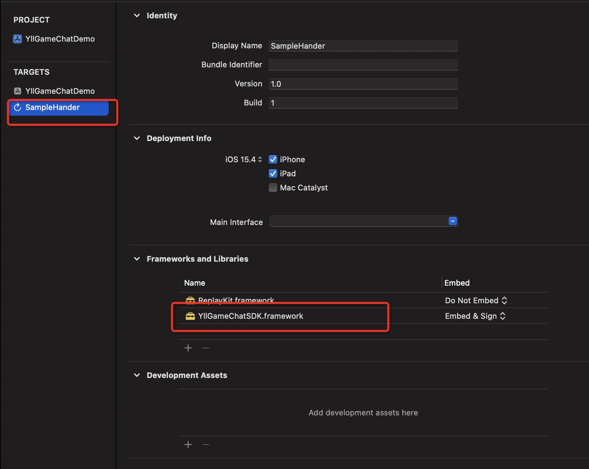
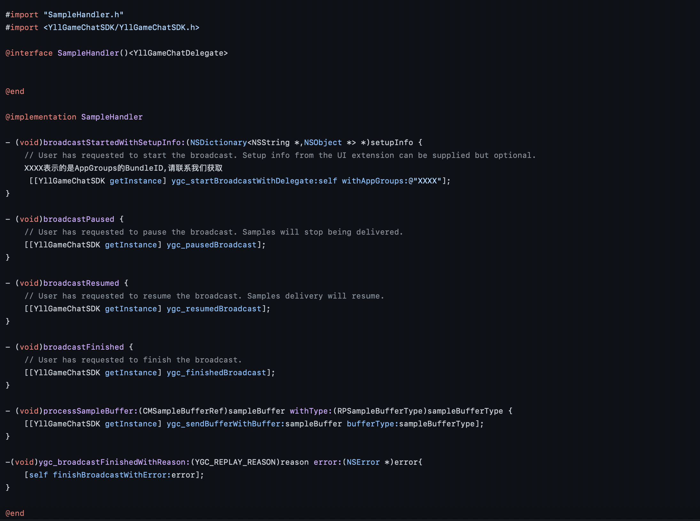

# iOS 接入文档

SDK下载地址(请联系对接人获取)

## 1. 接入前环境配置

**需要安装cocoapods管理工具([参考](https://www.kancloud.cn/god-is-coder/cocoapods/617031))**

**XCode13.3+, iOS10.0+**

**SDK不支持bitcode，项目请勿打开**

## 2. iOS项目修改

### 2.1 添加资源

- 将 iOS 目录下的 YllGameChatSDK.framework 文件夹拷贝到项目中正确目录下
- 右键项目，选择 Add File to "XXX"，选择刚才添加的framework，勾选 "Copy items if needed"，选择 "Create groups"，targets勾选mobile

### 2.2 配置项目

#### 1. cd 到 xxx.xcodeproj 目录下，pod init 创建pod管理文件

#### 2. 在podfile文件中添加以下依赖库
```obj-c
target 'XXX' do ///XXX代表主工程名
  #pod 'AgoraAudio_iOS', '~> 3.5.0.3' /// SDKv1.0.2 替换为 AgoraRtcEngine_iOS
  pod 'AgoraRtcEngine_iOS','~> 3.7.0', :subspecs => ['RtcBasic', 'ReplayKit']
  pod 'SwiftProtobuf', '~> 1.17.0'
end

target 'SampleHander' do ///SampleHander代表屏幕录制Target,系统默认是SampleHander。若新建target修改了名称需要换成已经修改的新名称
  use_frameworks!
  pod 'AgoraRtcEngine_iOS','~> 3.7.0', :subspecs => ['RtcBasic', 'ReplayKit']
  pod 'SwiftProtobuf', '~> 1.17.0'
end

```

- 去掉use_frameworks!前的#
- 在工程的相对应的 `Targets` -> `Build Settings` 的 `Other Linker Flags` ，添加`$(inherited)`
- 然后执行 pod install
- 注意：若出现错误 [!] Unable to find a target named `SampleHander` in project `YGCGameChatDemo.xcodeproj`, did find `YGCGameChatDemo`. 请参考2.5.2步骤新建`SampleHander` Target

### 2.3 SDK所需权限设置
- Privacy - Microphone Usage Description 麦克风权限
- Privacy - Tracking Usage Description IDFA权限 
- Privacy - Location Always and When In Use Usage Description 地理位置权限
- Privacy - Location Always Usage Description 地理位置权限
- Privacy - Location Usage Description 地理位置权限
- Privacy - Location When In Use Usage Description 地理位置权限
- Privacy - Media Library Usage Description  播放音乐视频权限 
- Privacy - Camera Usage Description 相机权限
- 权限的具体描述请根据游戏的实际使用进行定义，如果游戏没有使用，可以向SDK方要通用的阿语描述

### 2.4 SDK后台播放功能设置


### 2.5 SDK录屏直播功能设置
- App Groups 配置账号由SDK方提供

#### 1. 配置Capabilities


#### 2. 新建Target
- 点击File -> New  -> Target -> iOS -> Boradcast Upload Extension ->Product Name(建议SampleHandler) -> Language(建议Objective-C语言)


- 点击TARGETS -> General ->将YllGameChatSDK 拖至 Frameworks and Libraries


#### 3. 添加录屏直播功能相关代码([示例文件](https://github.com/yllgame2021/yllgame_chatsdk/tree/main/iOS/SampleHandler))


## 3. SDK初始化与API接口

### 3.1 导入SDK文件头
```obj-c
#import <YllGameChatSDK/YllGameChatSDK.h>
```
- 如果导入报错，可替换成以下这个
```obj-c
#import <YllGameChatSDK/YllGameChatSDK-Swift.h>
```

### 3.2 登陆房间
```obj-c
/// 登录房间操作
/// @param webSocketURL socket 地址
/// @param config 房间配置项
/// @param delegate 代理协议 (YllGameChatDelegate)
/// @param completionHandler 操作结果回调
[[YllGameChatSDK getInstance] ygc_loginWithWebSocketURL:<#(nonnull NSString *)#> config:<#(YllGameChatConfig * _Nonnull)#> delegate:<#(nonnull id)#> completionHandler:<#^(YGC_CHAT_STATE state, YGChatLogInResModel * _Nullable model, int32_t errorCode)completionHandler#>];
```

- 遵循代理 YllGameChatDelegate，实现代理方法
```obj-c
/// 通知用户进出房
- (void)ygc_notifyUserLog:(YGChatNotifyRoomUserChangeModel * _Nonnull)model;
/// 通知用户上麦成功
- (void)ygc_notifyUserMicUp:(YGChatNotifyUserMicUpModel * _Nonnull)model;
/// 通知用户被邀请上麦
- (void)ygc_notifyInviteMicUp:(YGChatNotifyInviteMicUpModel * _Nonnull)model;
/// 通知用户下麦
- (void)ygc_notifyUserMicDown:(YGChatNotifyUserMicDownModel * _Nonnull)model;
/// 通知被踢下麦用户 你已被踢下麦
- (void)ygc_notifyKickMic:(YGChatNotifyKickMicModel * _Nonnull)model;
/// 通知锁麦消息
- (void)ygc_notifyMicLocked:(YGChatNotifyMicModel * _Nonnull)model;
/// 通知解麦消息
- (void)ygc_notifyMicUnLocked:(YGChatNotifyMicModel * _Nonnull)model;
/// 通知房间内用户 禁言/解除禁言
- (void)ygc_notifyRoomUserSilence:(YGChatNotifyRoomUserSilenceModel * _Nonnull)model;
/// 通知房间内用户 踢出房间
- (void)ygc_notifyRoomUserKick:(YGChatNotifyRoomUserKickModel * _Nonnull)model;
/// 通知房间内用户  取消房间管理员
- (void)ygc_notifyRoomManagerDown:(YGChatNotifyRoomManagerModel * _Nonnull)model;
/// 通知房间内用户 升级为管理员接口
- (void)ygc_notifyRoomMemberUp:(YGChatNotifyRoomMemberModel * _Nonnull)model;
/// 通知用户已被房间封禁
- (void)ygc_notifyRoomUserBanned:(YGChatNotifyRoomUserBannedModel * _Nonnull)model;
/// 系统广播
- (void)ygc_notifySystemBroadcast:(YGChatNotifySystemBroadcastModel * _Nonnull)model;
/// 房间后台禁言封禁
- (void)ygc_notifySystemUserBan:(YGChatNotifySystemUserBanModel * _Nonnull)model;
/// 通知发送聊天文字消息
- (void)ygc_notifySayText:(YGChatNotifySayTextModel * _Nonnull)model;
/// 通知发送表情消息
- (void)ygc_notifySaySticker:(YGChatNotifySayStickerModel * _Nonnull)model;
/// 通知发送钻石礼物
- (void)ygc_notifySendDiamondGift:(YGChatNotifySendDiamondGiftModel * _Nonnull)model;
/// 房间信息变更
- (void)ygc_notifyRoomInfoChange:(YGChatNotifyRoomInfoChangeModel * _Nonnull)model;
/// 播放设备变更
- (void)ygc_didAudioRouteChanged:(AgoraRtcEngineKit * _Nonnull)engine routing:(AgoraAudioOutputRouting)routing;
/// 用户音量提示回调
/// @param speakers    用户音量信息，如果 speakers 为空，则表示远端用户不发流或没有远端用户。
/// @param totalVolume 混音后的总音量，取值范围为 [0,255], 在本地用户的回调中，totalVolume 为本地发流用户的音量, 在远端用户的回调中，totalVolume 为瞬时音量最高的远端用户（最多 3 位）混音后的总音量。
- (void)ygc_reportAudioVolumeIndication:(AgoraRtcEngineKit * _Nonnull)engine speakers:(NSArray<AgoraRtcAudioVolumeInfo *> * _Nonnull)speakers totalVolume:(int64_t)totalVolume;
/// 发生错误回调, 该函数的主要目的是为了App可以根据errorCode的值做一些对应的可视化的提示
/// 比如启动通话失败时，会上报 CODE_AGORAStartCall = 1002 错误。App可以提示用户启动通话失败。
- (void)ygc_audioErrorWithErrorCode:(AgoraErrorCode)errorCode;
/// socket 状态更改
- (void)ygc_onConnectionChange:(YGC_SOCKET_STATE)state;
```
- SDK v1.0.1 新增代理
```obj-c
/// 开启直播通知
- (void)ygc_notifyRoomLiveStart:(YGRoomLiveNoticeModel * _Nonnull)model;
/// 关闭直播通知
- (void)ygc_notifyRoomLiveStop:(YGRoomLiveNoticeModel * _Nonnull)model;
/// 通知发送图片消息
- (void)ygc_notifySayImage:(YGChatNotifySayImageModel * _Nonnull)model;
/// 录屏回调
- (void)ygc_broadcastFinishedWithReason:(YGC_REPLAY_REASON)reason;;
```
- SDK v1.0.2 新增代理
```obj-c
/// 通知房间麦序被改变
- (void)ygc_notifyChangeMic:(YGChatNotifyChangeMicModel * _Nonnull)model;
/// 联盟房间拥有者改变
- (void)ygc_notifyUnionRoomOwnerChange:(YGRoomChangeUnionRoomOwner * _Nonnull)model;;
```

### 3.3 退出房间
```obj-c
/// 登出房间操作
/// @param completionHandler 操作结果回调
[[YllGameChatSDK getInstance] ygc_logoutWithCompletionHandler:<#^(YGC_CHAT_STATE state, int32_t errorCode)completionHandler#>];
```

### 3.4 加载房间在线用户列表
```obj-c
/// 获取房间内在线用户信息列表
/// @param userId 用户Id 首次加载传0, 加载下一页, 传最后一个用户的userid
/// @param priority 用户排序权重值, 首次加载传0, 加载下一页, 传最后一个用户的priority
/// @param completionHandler 操作结果回调
[[YllGameChatSDK getInstance] ygc_loadUserListWithUserId:<#(int64_t)#> priority:<#(int64_t)#> keyword:<#(nonnull NSString *)#> completionHandler:<#^(YGC_CHAT_STATE state, YGChatModel * _Nullable model, int32_t socketErrorCode)completionHandler#>];
```

### 3.5 刷新房间在线用户列表
```obj-c
/// 刷新房间在线用户信息数组
/// @param completionHandler 结果回调
[[YllGameChatSDK getInstance] ygc_refreshUserListWithCompletionHandler:<#^(YGC_CHAT_STATE state, YGChatModel * _Nullable model, int32_t socketErrorCode)completionHandler#>];
```

### 3.6 上麦
```obj-c
/// 上麦操作
/// @param operatorId 操作者用户Id, 0或者用户自己Id表示用户自己上麦, 其他Id表示该用户被邀请上麦
/// @param micOrder 麦序, 邀请上麦时随机分配
/// @param completionHandler 操作结果回调
[[YllGameChatSDK getInstance] ygc_micUpWithOperatorId:<#(int64_t)#> micOrder:<#(int32_t)#> completionHandler:<#^(YGC_CHAT_STATE state, YGChatModel * _Nullable model, int32_t socketErrorCode)completionHandler#>];
```

### 3.7 邀请上麦
```obj-c
/// 上麦操作
/// @param operatorId 操作者用户Id, 0或者用户自己Id表示用户自己上麦, 其他Id表示该用户被邀请上麦
/// @param micOrder 麦序, 邀请上麦时随机分配
/// @param completionHandler 操作结果回调
[[YllGameChatSDK getInstance] ygc_inviteMicWithInviteeId:<#(int64_t)#> completionHandler:<#^(YGC_CHAT_STATE state, YGChatModel * _Nullable model, int32_t socketErrorCode)completionHandler#>];
```

### 3.8 下麦
```obj-c
/// 下麦操作
/// @param completionHandler 操作结果回调
[[YllGameChatSDK getInstance] ygc_micDownWithCompletionHandler:<#^(YGC_CHAT_STATE state, int32_t errorCode)completionHandler#>];
```

### 3.9 踢下麦
```obj-c
/// 踢下麦
/// @param userId 被踢下麦用户id
/// @param micOrder 麦序
/// @param completionHandler 操作结果回调
[[YllGameChatSDK getInstance] ygc_kickMicWithUserId:<#(int64_t)#> micOrder:<#(int32_t)#> completionHandler:<#^(YGC_CHAT_STATE state, YGChatKickMicResModel * _Nullable model, int32_t errorCode)completionHandler#>];
```

### 3.10 锁麦位
```obj-c
/// 锁麦位
/// @param micOrder 麦序
/// @param completionHandler 操作结果回调
[[YllGameChatSDK getInstance] ygc_lockMicWithMicOrder:<#(int32_t)#> completionHandler:<#^(YGC_CHAT_STATE state, YGChatMicResModel * _Nullable model, int32_t errorCode)completionHandler#>];
```

### 3.11 解锁麦位
```obj-c
/// 解锁麦位
/// @param micOrder 麦序
/// @param completionHandler 操作结果回调
[[YllGameChatSDK getInstance] ygc_unlockMicWithMicOrder:<#(int32_t)#> completionHandler:<#^(YGC_CHAT_STATE state, YGChatMicResModel * _Nullable model, int32_t errorCode)completionHandler#>];
```

### 3.12 禁言/解除禁言
```obj-c
/// 禁言/解除禁言
/// @param userId 被操作用户id
/// @param enable true 禁言, false 解除
/// @param type 禁言类型  0 禁麦  1 禁文字消息
/// @param completionHandler 操作结果回调
[[YllGameChatSDK getInstance] ygc_roomUserSilenceWithUserId:<#(int64_t)#> enable:<#(BOOL)#> type:<#(int32_t)#> completionHandler:<#^(YGC_CHAT_STATE state, YGChatRoomUserSilenceResModel * _Nullable model, int32_t errorCode)completionHandler#>];
```

### 3.13 用户踢出房间
```obj-c
/// 用户踢出房间
/// @param userId 被T用户id
/// @param completionHandler 操作结果回调
[[YllGameChatSDK getInstance] ygc_roomUserKickWith:<#(int64_t)#> completionHandler:<#^(YGC_CHAT_STATE state, YGChatRoomUserKickResModel * _Nullable model, int32_t errorCode)completionHandler#>];
```

### 3.14 更改房间公告
```obj-c
/// 更改房间公告
/// @param context 公告内容
/// @param completionHandler 操作结果回调
[[YllGameChatSDK getInstance] ygc_changeRoomNoticeWithcontext:<#(nonnull NSString *)#> completionHandler:<#^(YGC_CHAT_STATE state, YGChatChangeRoomInfoResModel * _Nullable model, int32_t errorCode)completionHandler#>];
```

### 3.15 取消房间管理员
```obj-c
/// 取消房间管理员
/// @param userId 被取消管理员的id
/// @param completionHandler 操作结果回调
[[YllGameChatSDK getInstance] ygc_roomManagerDownWithUserId:<#(int64_t)#> completionHandler:<#^(YGC_CHAT_STATE state, YGChatRoomUserKickResModel * _Nullable model, int32_t errorCode)completionHandler#>];
```

### 3.16 升级房间管理员
```obj-c
/// 设置房间管理员
/// @param userId 被设为管理员用户id
/// @param completionHandler 操作结果回调
[[YllGameChatSDK getInstance] ygc_roomMemberUpWithUserId:<#(int64_t)#> completionHandler:<#^(YGC_CHAT_STATE state, YGChatRoomUserKickResModel * _Nullable model, int32_t errorCode)completionHandler#>];
```

### 3.17 更改房间名
```obj-c
/// 更改房间名
/// @param name 房间名
/// @param completionHandler 操作结果回调
[[YllGameChatSDK getInstance] ygc_changeRoomNameWithName:<#(nonnull NSString *)#> completionHandler:<#^(YGC_CHAT_STATE state, YGChatChangeRoomInfoResModel * _Nullable model, int32_t errorCode)completionHandler#>];
```

### 3.18 更改房间图片
```obj-c
/// 更改房间图片
/// @param iconUrl 图片url
/// @param completionHandler 操作结果回调
[[YllGameChatSDK getInstance] ygc_changeRoomIconWithIconUrl:<#(nonnull NSString *)#> completionHandler:<#^(YGC_CHAT_STATE state, YGChatChangeRoomInfoResModel * _Nullable model, int32_t errorCode)completionHandler#>];
```

### 3.19 房间等级升级
```obj-c
/// 房间等级升级
/// @param completionHandler 操作结果回调
[[YllGameChatSDK getInstance] ygc_upgradeRoomLevelWithCompletionHandler:<#^(YGC_CHAT_STATE state, YGChatChangeRoomInfoResModel * _Nullable model, int32_t errorCode)completionHandler#>];
```

### 3.20 房间上麦模式变更
```obj-c
/// 房间上麦模式变更
/// @param type 上麦模式 0自由上麦，1邀请上麦
/// @param completionHandler 操作结果回调
[[YllGameChatSDK getInstance] ygc_changeRoomMicUpTypeWithType:<#(int32_t)#> completionHandler:<#^(YGC_CHAT_STATE state, YGChatChangeRoomMicUpTypeResModel * _Nullable model, int32_t errorCode)completionHandler#>];
```

### 3.21 房间内送礼排行榜
```obj-c
/// 房间礼物排行榜
/// @param rankType 排行榜类型 0 last24hour 1 last7d
/// @param completionHandler 操作结果回调
[[YllGameChatSDK getInstance] ygc_roomPropRankWithRankType:<#(int32_t)#> completionHandler:<#^(YGC_CHAT_STATE state, YGChatRoomPropRankResModel * _Nullable model, int32_t errorCode)completionHandler#>];
```

### 3.22 封禁/解封用户
```obj-c
/// 封禁/解封用户
/// @param targetUserId 目标用户id
/// @param enable true封禁 false解封
/// @param completionHandler 操作结果回调
[[YllGameChatSDK getInstance] ygc_roomUserBanWithTargetUserId:<#(int64_t)#> enable:<#(BOOL)#> completionHandler:<#^(YGC_CHAT_STATE state, YGChatRoomUserBanResModel * _Nullable model, int32_t errorCode)completionHandler#>];
```

### 3.23 封禁用户列表
```obj-c
/// 封禁用户列表
/// @param page 分页page 1 开始
/// @param completionHandler 操作结果回调
[[YllGameChatSDK getInstance] ygc_roomUserBanListWithPage:<#(int32_t)#> completionHandler:<#^(YGC_CHAT_STATE state, YGCharRoomUserListResModel * _Nullable model, int32_t errorCode)completionHandler#>];
```


### 3.24 房间管理员列表
```obj-c
/// 房间管理员列表
/// @param completionHandler 操作结果回调
[[YllGameChatSDK getInstance] ygc_roomManagerListWithCompletionHandler:<#^(YGC_CHAT_STATE state, YGCharRoomUserListResModel * _Nullable model, int32_t errorCode)completionHandler#>];
```

### 3.25 跳转房间
```obj-c
/// @param roomId 目标房间id
/// @param frontRoomId 当前房间id
/// @param password 目标房间密码
/// @param languageType 语言类型
/// @param completionHandler 操作回调结果
[[YllGameChatSDK getInstance] ygc_jumpRoomWithRoomId:<#(int64_t)#> frontRoomId:<#(int64_t)#> password:<#(nonnull NSString *)#> languageType:<#(YGC_LANGUAGE_TYPE)#> completionHandler:<#^(YGC_CHAT_STATE state, YGChatLogInResModel * _Nullable model, int32_t errorCode)completionHandler#>];
```

### 3.26 设置密码房
```obj-c
/// 设置密码房
/// @param pwd 房间密码
/// @param completionHandler 操作结果回调
[[YllGameChatSDK getInstance] ygc_setRoomPwdWithPwd:<#(nonnull NSString *)#> completionHandler:<#^(YGC_CHAT_STATE state, int32_t errorCode)completionHandler#>];
```

### 3.27 解锁密码房
```obj-c
/// 解锁密码房
/// @param completionHandler 操作结果回调
[[YllGameChatSDK getInstance] ygc_unlockPwdRoomWithCompletionHandler:<#^(YGC_CHAT_STATE state, int32_t errorCode)completionHandler#>];
```

### 3.28 购买密码房
```obj-c
/// 解锁密码房
/// @param completionHandler 操作结果回调
[[YllGameChatSDK getInstance] ygc_buyPwdRoomWithCompletionHandler:<#^(YGC_CHAT_STATE state, int32_t errorCode)completionHandler#>];
```

### 3.29 发送文字聊天消息
```obj-c
/// 发送聊天文字消息
/// @param text 文案
/// @param atUsers at用户的id数组
/// @param completionHandler 操作结果回调
[[YllGameChatSDK getInstance] ygc_sayTextWithText:<#(nonnull NSString *)#> atUsers:<#(nonnull NSArray<YGChatAtUserModel *> *)#> completionHandler:<#^(YGC_CHAT_STATE state, YGChatSayTextResModel * _Nullable model, int32_t errorCode)completionHandler#>];
```

### 3.30 发送表情包
```obj-c
/// 发送表情包消息
/// @param imageUrl 表情url地址
/// @param picWidth 表情宽
/// @param picHeight 表情高
/// @param stickerId 表情结果
/// @param completionHandler 操作结果回调
[[YllGameChatSDK getInstance] ygc_sayStickerWithImageUrl:<#(nonnull NSString *)#> picWidth:<#(int32_t)#> picHeight:<#(int32_t)#> stickerId:<#(int32_t)#> completionHandler:<#^(YGC_CHAT_STATE state, YGChatSayStickerResModel * _Nullable model, int32_t errorCode)completionHandler#>];
```

### 3.31 发送钻石礼物
```obj-c
/// 发送钻石礼物
/// @param toId 被送用户id
/// @param giftId 礼物id
/// @param number 礼物数量
/// @param completionHandler 操作结果回调
[[YllGameChatSDK getInstance] ygc_sendDiamondGiftWithToId:<#(int64_t)#> giftId:<#(int64_t)#> number:<#(int32_t)#> completionHandler:<#^(YGC_CHAT_STATE state, YGChatSendDiamondGiftResModel * _Nullable model, int32_t errorCode)completionHandler#>];
```

### 3.32 获取房间等级配置
```obj-c
/// 获取房间等级配置
/// @param completionHandler 操作结果回调
[[YllGameChatSDK getInstance] ygc_roomLevelConfigWithCompletionHandler:<#^(YGC_CHAT_STATE state, YGChatRoomLevelConfigResModel * _Nullable model, int32_t errorCode)completionHandler#>];
```

### 3.33 获取房间锁价格
```obj-c
/// 获取房间锁价格
/// @param completionHandler 操作结果回调
[[YllGameChatSDK getInstance] ygc_roomLockPriceWithCompletionHandler:<#^(YGC_CHAT_STATE state, YGChatRoomLockPriceResModel * _Nullable model, int32_t errorCode)completionHandler#>];
```

### 3.34 取消或恢复订阅所有远端用户的音频流
```obj-c
/// 取消或恢复订阅所有远端用户的音频流
/// @param mute yes 取消订阅, false 恢复
/// @param completionHandler 操作结果回调
[[YllGameChatSDK getInstance] ygc_muteAllRemoteAudioStreams:<#(BOOL)#> completionHandler:<#^(YGC_CHAT_STATE state, int32_t errorCode)completionHandler#>];
```

### 3.35 取消或恢复订阅指定远端用户的音频流
```obj-c
/// 取消或恢复订阅指定远端用户的音频流
/// @param userId 指定用户的用户 ID
/// @param mute yes 取消订阅, false 恢复
/// @param completionHandler 操作结果回调
[[YllGameChatSDK getInstance] ygc_muteRemoteAudioStream:<#(NSUInteger)#> mute:<#(BOOL)#> completionHandler:<#^(YGC_CHAT_STATE state, int32_t errorCode)completionHandler#>];
```

### 3.36 设置是否扬声器播放(SDK默认扬声器)
```obj-c
/// 设置是否扬声器播放, SDK默认设置扬声器播放
/// @param enableSpeaker true: 从外放（扬声器）出声。如果设备连接了耳机或蓝牙，则无法切换到外放   false: 默认从听筒出声。如果设备连接了耳机，则语音路由走耳机
/// @param completionHandler 操作结果回调
[[YllGameChatSDK getInstance] ygc_setEnableSpeakerphone:<#(BOOL)#> completionHandler:<#^(YGC_CHAT_STATE state, int32_t errorCode)completionHandler#>];
```

### 3.37 开启/关闭本地麦克风
```obj-c
/// 开启/关闭本地麦克风
/// @param mute true: 关闭   false: 开启
/// @param completionHandler 操作结果回调
[[YllGameChatSDK getInstance] ygc_muteLocalMicWithMute:<#(BOOL)#> completionHandler:<#^(YGC_CHAT_STATE state, int32_t errorCode)completionHandler#>];
```

### 3.38 获取当前聊天室信息
```obj-c
/// 获取当前聊天室信息
/// @param completionHandler 操作结果回调
[[YllGameChatSDK getInstance] ygc_getCurrentRoomInfoWithCompletionHandler:<#^(YGChatRoomViewModel * _Nullable model)completionHandler#>];
```

### 3.39 房间背景音乐
```obj-c
/// 展示房间背景音乐
/// @param completionHandler 操作结果回调
[[YllGameChatSDK getInstance] ygc_showMusciPlayerWithCompletionHandler:<#^(YGC_CHAT_STATE state)completionHandler#>];
```

### 3.40 发送图片消息
```obj-c
/// 发送图片消息
/// @param imageUrl 图片url地址
/// @param completionHandler 操作结果回调
[[YllGameChatSDK getInstance] ygc_sayImageWithImageUrl:<#(nonnull NSString *)#> completionHandler:<#^(YGC_CHAT_STATE state, YGChatSayImageResModel * _Nullable model, int32_t errorCode)completionHandler#>];
```

### 3.41 直播主进程操作
- 开始/关闭直播
```obj-c
/// 开始/关闭直播
/// @param broadcastName 创建的broadcat upload Extension 的名字
/// @param completionHandler 操作结果回调
[[YllGameChatSDK getInstance] ygc_roomOpenLiveWithBroadcastName:<#(nonnull NSString *)#> completionHandler:<#^(YGC_CHAT_STATE state, int32_t errorCode)completionHandler#>];
```

- 观看直播
```obj-c
/// @param completionHandler 操作结果回调
[[YllGameChatSDK getInstance] ygc_roomPlayLiveWithCompletionHandler:<#^(YGC_CHAT_STATE state, int32_t errorCode)completionHandler#>];
```
### 3.42 录屏直播 Extesion 进程操作
- 开始广播
```obj-c
/// 开始广播
/// @param delegate 代理协议 (YllGameChatDelegate)
/// 注: 只在Extension SampleHandler 里面调用
[[YllGameChatSDK getInstance] ygc_startBroadcastWithDelegate:<#(nonnull id)#>];
```

- 暂停广播
```obj-c
/// 暂停广播
/// 注: 只在Extension SampleHandler 里面调用
[[YllGameChatSDK getInstance] ygc_pausedBroadcast];
```

- 继续广播
```obj-c
/// 继续广播
/// 注: 只在Extension SampleHandler 里面调用
[[YllGameChatSDK getInstance] ygc_resumedBroadcast];
```

- 停止广播
```obj-c
/// 停止广播
/// 注: 只在Extension SampleHandler 里面调用
[[YllGameChatSDK getInstance] ygc_finishedBroadcast];
```
### 3.42 房间麦序切换
- 房间麦序切换
```obj-c
/// 房间麦序切换
/// @param oldMicOrder 老麦序
/// @param newMicOrder 新麦序
/// @param completionHandler 操作结果回调
[[YllGameChatSDK getInstance] ygc_changeMicWithOldMicOrder:<#(int32_t)#> newMicOrder:<#(int32_t)#> completionHandler:<#^(YGC_CHAT_STATE state, YGChatChangeMicResModel * _Nullable model, int32_t errorCode)completionHandler#>];
```
